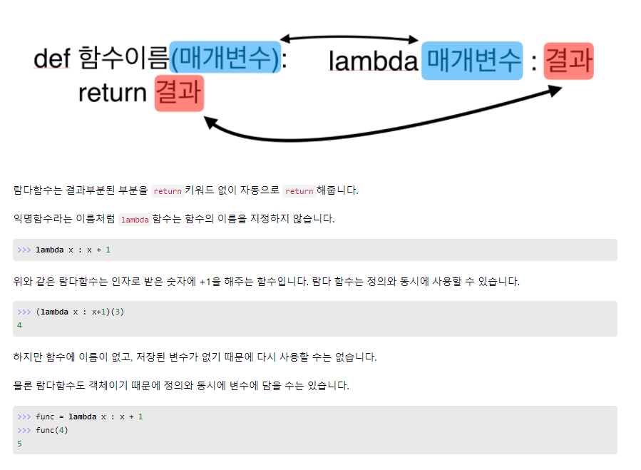
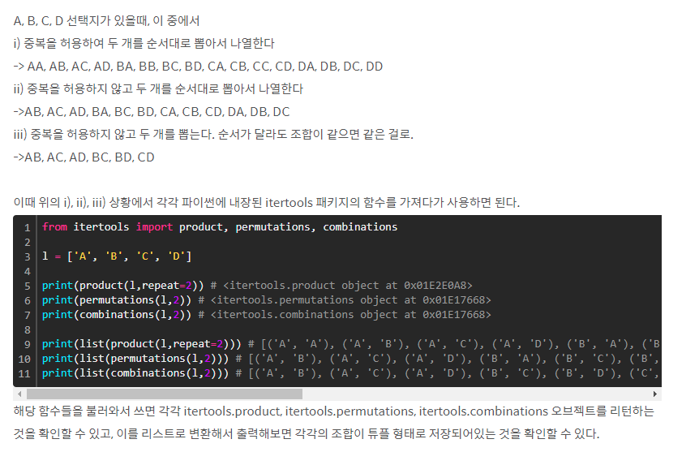

# :boom: 모음사전


```python
from itertools import product

solution = lambda word: sorted(["".join(c) for i in range(5) for c in product("AEIOU", repeat=i+1)]).index(word) + 1


### 풀어서 쓰면###
ans = []
for i in range(5):
    for c in product("AEIOU", repeat=i+1):
        ans.append("".join(c))

solution = sorted(ans).index(word) + 1
print(solution)

```


### [lambda 함수]




### [product, permutations, combinations]

​			




### sorted, sort 문자열

1. **sort**() : 알파벳 순서로 **문자열 정렬** list.**sort**() 는 대문자에서 소문자 순서로, 알파벳 순서로 **정렬**
2. list.**sorted**() : 알파벳 순서로 **문자열 정렬**

